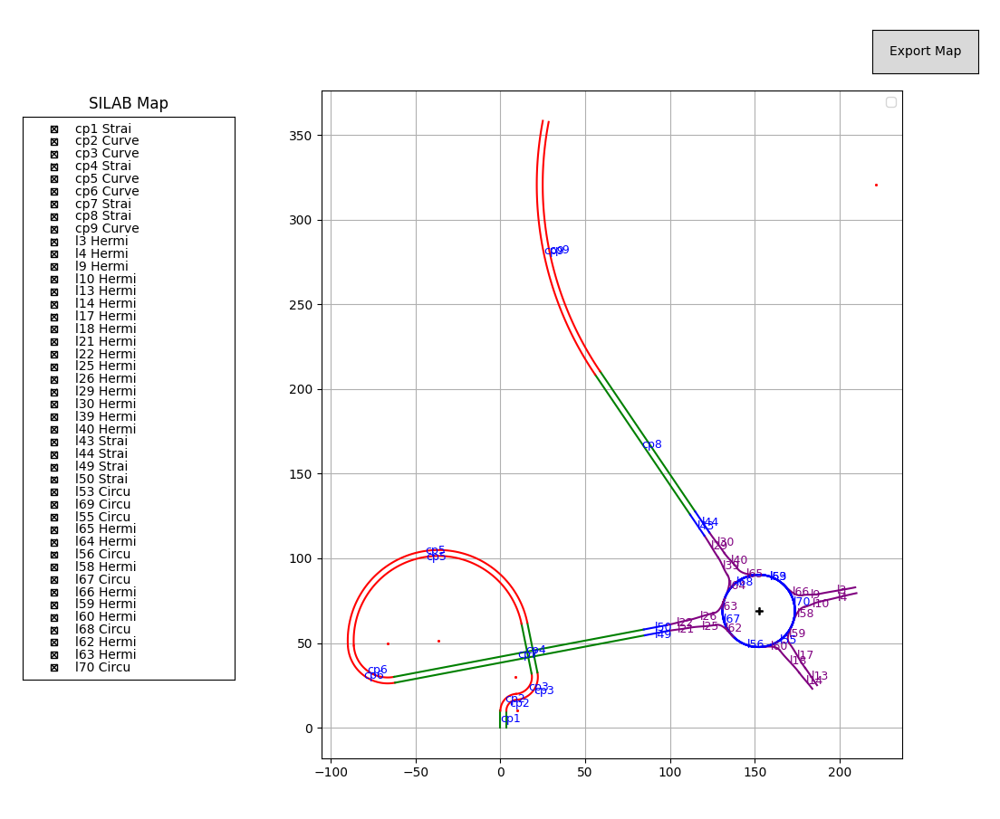

# Parser for SILAB Map conversion

NOTE: This code is not complete! Some manual adjustmenst might be needed.

How to convert a SILAB map into a plot?

1. SILAB maps consist of Courses and Area2 (-Edits). To retrieve all relevant lane structure data
from the latter, one can use `parser\parse.py`, which writes the important data of a `*_Area2.cfg` 
file into a JSON file. 

2. Courses (Straights & Bends) must manually be inserted. Insert them as shown in the example 
`parser\full_example.json` under key `"elements"`.

3. Insert the output of `parser\parse.py` in the same JSON. Insert also connections that you find 
in your `*_Area2.cfg` (see example `parser\full_example.json`; key `"Connections"`).

4. Manually add the connections between separate modules (Courses and Area2). To do so, use 
`"CustomConnections"`. 

5. Run `parser\run.py` to view the results. 

Example: 

--> Contains two normal Courses and one Area2 -> the roundabout. 